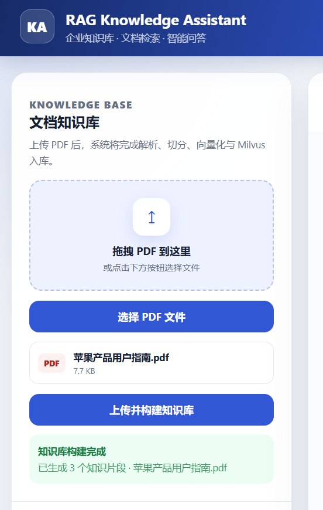
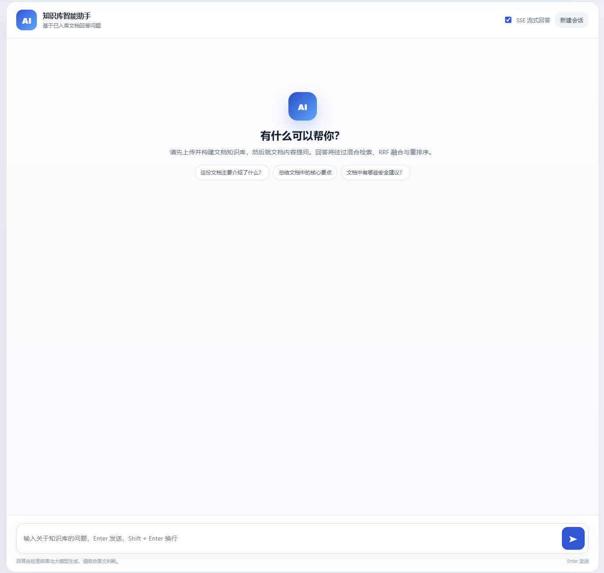
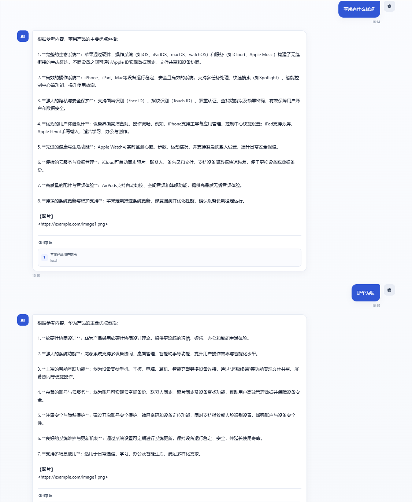
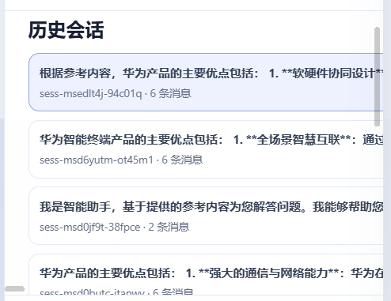
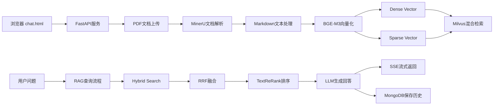
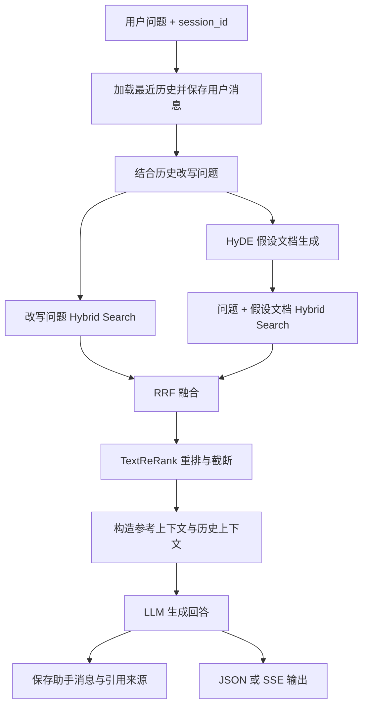

# RAG Knowledge Assistant

## 1. 项目介绍

这是一个基于 RAG（Retrieval-Augmented Generation）技术构建的知识库问答系统。系统支持 PDF 文档上传、知识库构建、文档检索增强问答以及基于会话历史的多轮对话。

后端使用 FastAPI 提供上传、问答、SSE 流式输出和历史会话接口；文档导入与查询流程基于 LangGraph 工作流组织；BGE-M3 为文本生成稠密和稀疏向量，Milvus 负责向量存储与混合检索，MongoDB 保存会话消息，LLM 根据重排后的参考内容生成回答。

## 2. 项目展示

### 文档上传与知识库构建



### RAG 智能问答





### 历史会话管理




## 3. 架构流程



核心组件：

- **FastAPI**：HTTP API、静态聊天页面和 SSE 响应入口。
- **LangGraph**：组织文档导入图和 RAG 查询图。
- **MinerU**：通过远程 API 将 PDF 解析为 Markdown 及相关资源。
- **BGE-M3 / FlagEmbedding**：一次编码同时生成 Dense Vector 和 Sparse Vector。
- **Milvus**：保存知识切片及向量，并执行 Dense/Sparse 混合检索。
- **DashScope TextReRank**：对 RRF 结果进行相关性重排。
- **MongoDB**：按 `session_id` 保存用户消息、助手回答、引用来源等历史数据。
- **MinIO**：文档解析结果包含有效图片时，用于保存处理后的图片资源。

## 4. 项目结构

```text
knowledge_base_0525/
├── config/                         # LLM、Embedding、Milvus、MinerU、MinIO、Rerank 配置
├── processor/
│   ├── import_processor/           # 文档导入 LangGraph、状态和节点
│   │   └── nodes/                  # 入口、PDF 解析、Markdown 处理、切分、向量化、入库
│   └── query_processor/            # RAG 查询 LangGraph、状态、提示词和节点
│       ├── nodes/                  # 改写、双路召回、RRF、Rerank、回答输出
│       └── prompt/                 # HyDE 与回答生成提示词
├── utils/                          # Milvus、MongoDB、Embedding、LLM、Rerank、SSE、MinIO 工具
├── web/
│   ├── api/query_service.py        # FastAPI 服务入口
│   └── page/chat.html              # 单页聊天前端
├── test/                           # 独立测试与实验脚本
├── data/                           # 上传文件、模型等本地数据目录
├── output/                         # MinerU 解析和中间结果目录
├── volumes/                        # Docker Compose 持久化目录
├── docker-compose.yml              # Milvus Standalone、etcd、MinIO
├── requirements.txt
└── .env.example                    # 环境变量示例
```

`processor` 中的节点通过共享的 TypedDict 状态传递数据。`import_processor` 负责把文件转换为可检索切片，`query_processor` 负责从用户问题构建检索上下文并生成回答。仓库中存在部分实验或未接入主图的节点文件；README 只描述当前主工作流实际注册的节点。

## 5. 后端服务与 API

FastAPI 入口为 `web/api/query_service.py`，直接运行时监听 `127.0.0.1:8001`。

| 方法 | 路径 | 作用 |
| --- | --- | --- |
| `GET` | `/chat.html` | 返回聊天页面 |
| `POST` | `/upload` | 上传 PDF，并同步执行解析、切分、向量化和 Milvus 入库 |
| `POST` | `/chat` | 提交问题；支持普通 JSON 响应或启动流式任务 |
| `POST` | `/query` | `/chat` 的兼容接口，当前已标记为 deprecated |
| `GET` | `/stream/{session_id}` | 建立 SSE 连接并接收任务进度、回答增量和最终结果 |
| `GET` | `/history/{session_id}` | 获取指定会话的消息记录 |
| `GET` | `/history` | 获取最近会话列表、预览和消息数量 |

### PDF 上传

`POST /upload` 使用 `multipart/form-data`，字段名为 `file`。服务仅接受 `.pdf` 文件，为每次上传创建独立任务目录，然后同步调用文档导入工作流。响应包含任务 ID、文件名、保存路径、Markdown 路径和切片数量。

### 问答与 SSE

`POST /chat` 请求体：

```json
{
  "query": "文档的主要内容是什么？",
  "session_id": "sess-example",
  "is_stream": true
}
```

非流式模式在工作流完成后直接返回 `answer`、`sources` 和 `image_urls`。流式模式先创建当前 `session_id` 对应的内存队列，再通过后台任务运行查询图；浏览器随后连接 `/stream/{session_id}`。

SSE 使用的事件包括：

- `ready`：连接建立。
- `progress`：工作流节点执行进度。
- `delta`：LLM 生成的文本增量。
- `final`：完整答案、引用来源和图片 URL。
- `error`：流式处理错误。

SSE 队列保存在服务进程内存中，并按 `session_id` 隔离；连接结束后对应队列会被移除。

## 6. 文档处理流程


导入图由 `KBImportWorkflow` 构建，当前节点如下：

1. **`a_node_entry`**：校验输入路径，识别 PDF 或 Markdown，生成 `file_title`，设置输出目录。Web 上传接口当前只允许 PDF。
2. **`b_node_pdf_to_md`**：向 MinerU 申请上传 URL、上传 PDF、轮询解析状态，下载并解压结果 ZIP，将 `full.md` 重命名为与源文件对应的 Markdown 文件。
3. **`c_node_md_img`**：读取 Markdown；没有 `images` 目录或有效图片引用时直接透传。存在有效图片时，代码会生成简短图片说明、上传图片到 MinIO，并替换 Markdown 中的图片引用。
4. **`d_node_document_split`**：优先按 Markdown 标题形成 section；无标题时使用兜底标题。超长 section 使用 `RecursiveCharacterTextSplitter` 继续切分，同一父标题下的短 section 会合并。
5. **`f_node_bge_embedding`**：分批拼接切片标题与正文，调用 BGE-M3 生成 Dense 和 Sparse 两类向量。
6. **`g_node_import_milvus`**：创建或复用 `kb_chunks`，按 `file_title` 删除同名旧切片，然后批量插入新切片并回写自动生成的 `chunk_id`。

`kb_chunks` 保存的主要字段包括 `chunk_id`、`content`、`title`、`parent_title`、`part`、`file_title`、`item_name`、`dense_vector` 和 `sparse_vector`。Dense 索引使用 `AUTOINDEX + COSINE`，Sparse 索引使用 `SPARSE_INVERTED_INDEX + IP`。

## 7. RAG 查询流程



### 7.1 查询预处理与历史上下文

`node_prepare_query` 校验 `session_id` 和问题文本，从 MongoDB 获取最近 10 条消息，并立即保存本轮用户消息。存在历史记录时，节点调用 LLM 将当前问题改写为语义完整、可独立检索的一句话；改写失败则继续使用原问题。

### 7.2 双路混合召回

查询图从预处理节点并行进入两条召回路径：

- **直接检索**：对改写问题生成 Dense/Sparse 向量，在 `kb_chunks` 上执行 Hybrid Search。
- **HyDE 检索**：先让 LLM 根据改写问题生成假设性文档，再对“改写问题 + 假设文档”编码并执行 Hybrid Search。

每条路径内部均包含：

- `dense_vector` 上的 COSINE ANN 检索；
- `sparse_vector` 上的 IP 检索；
- Milvus `WeightedRanker` 对 Dense/Sparse 结果进行合并。

直接路径当前使用 Dense/Sparse 权重 `0.8/0.2`；HyDE 路径使用工具函数默认权重 `0.5/0.5`。单路默认召回 5 条结果。

### 7.3 RRF 融合

`node_rrf` 对直接检索和 HyDE 检索的结果执行 Reciprocal Rank Fusion。两路权重均为 `1.0`，常数 `k=60`，以 `chunk_id` 去重并累加排名贡献，最终保留前 5 条。

### 7.4 Rerank

Milvus 混合检索和 RRF 主要解决多路候选召回与融合问题；Rerank 则使用查询与候选正文重新计算相关性，使进入回答上下文的内容更贴近当前问题。

`node_rerank` 将 RRF 结果规范化为本地文档结构，调用 DashScope `TextReRank` 获取每条候选的 `relevance_score`，按分数降序排列。随后执行分数“断崖”截断：至少考虑前 3 条、最多 10 条，当相邻结果绝对分差不小于 `0.5` 或相对分差不小于 `0.25` 时截断后续结果。

### 7.5 回答生成

`node_answer_output` 将重排后的文档、历史对话和改写问题组装为回答 Prompt，参考内容与历史内容共享 12000 字符预算。LLM 支持普通调用和流式调用；节点同时提取最终使用文档中的引用来源与图片 URL，并将助手回答写入 MongoDB。

当前查询图没有注册 Web Search 节点，因此现行主流程的检索来源是本地 Milvus 知识库。

## 8. LangGraph 工作流

项目使用 `langgraph.graph.StateGraph` 管理两个独立工作流，不包含自主决策型 Agent。

### 文档导入图

```text
a_node_entry
  ├─ PDF → b_node_pdf_to_md ─┐
  └─ MD  ────────────────────┤
                             ↓
c_node_md_img → d_node_document_split
→ f_node_bge_embedding → g_node_import_milvus
```

入口节点根据文件后缀进行条件路由。FastAPI 上传接口限制为 PDF，但工作流本身也保留从本地 Markdown 文件开始处理的路径。

### RAG 查询图

```text
node_prepare_query
  ├─ node_search_embedding ───────┐
  └─ node_search_embedding_hyde ──┤
                                  ↓
node_rrf → node_rerank → node_answer_output → END
```

两个检索节点共享工作流状态并行执行，随后在 RRF 节点汇合。最终节点负责 Prompt 构造、LLM 调用、SSE 增量推送、引用整理及历史写入。

## 9. 历史会话

MongoDB 中的 `chat_message` collection 保存消息，主要字段包括：

- `session_id`：会话标识；
- `role`、`text`：消息角色和内容；
- `rewritten_query`、`item_names`：检索相关元数据；
- `image_urls`、`sources`：回答关联的图片与结构化引用；
- `ts`：消息时间。

代码为 `(session_id, ts)` 创建复合索引。查询准备节点读取指定会话最近 10 条消息用于问题改写；回答节点保存助手结果。API 可以读取单个会话的消息，也可以通过聚合查询返回最近会话、最后更新时间、预览文本和消息数量。

前端将当前 `session_id` 保存在 `localStorage`。历史面板调用 `/history` 展示会话列表，点击后切换 session 并调用 `/history/{session_id}` 恢复用户消息、AI 消息、图片和引用来源；“新建会话”会生成新的本地会话 ID。

## 10. 前端页面

前端位于 `web/page/chat.html`，使用原生 HTML、CSS 和 JavaScript 实现，当前包括：

- PDF 点击选择和拖拽上传区域；
- 文件名、文件大小、上传状态和生成切片数展示；
- 用户消息与 AI 消息气泡；
- 普通回答与 SSE 流式回答切换；
- 工作流进度和回答增量显示；
- 最近历史会话列表与会话切换；
- 结构化引用来源展示，本地来源显示文件名，HTTP 来源可点击跳转；
- 回答关联图片展示；
- 响应式布局。

## 11. 配置与运行

### 11.1 环境要求

- Python 3.10+
- Docker 与 Docker Compose
- MongoDB：用于保存历史会话数据，需要单独部署
- 可用的 MinerU API、OpenAI 兼容 LLM API及 DashScope TextReRank 配置
- BGE-M3 本地模型目录，或可解析的模型名称

### 11.2 安装依赖

```bash
python -m venv .venv
```

Windows PowerShell：

```powershell
.\.venv\Scripts\Activate.ps1
pip install -r requirements.txt
```

### 11.3 环境变量

复制示例文件并填写实际配置：

```powershell
Copy-Item .env.example .env
```

主要变量：

| 变量 | 作用 |
| --- | --- |
| `MINERU_API_TOKEN`、`MINERU_BASE_URL` | MinerU 文档解析 |
| `OPENAI_API_KEY`、`OPENAI_API_BASE` | LLM 与 DashScope 相关调用 |
| `LLM_DEFAULT_MODEL`、`LLM_DEFAULT_TEMPERATURE` | 回答和查询改写模型 |
| `VL_MODEL` | Markdown 图片处理使用的模型 |
| `BGE_M3_PATH`、`BGE_M3` | BGE-M3 本地路径或模型名 |
| `BGE_DEVICE`、`BGE_FP16` | Embedding 运行设备与精度 |
| `MILVUS_URL` | Milvus 地址 |
| `CHUNKS_COLLECTION` | 知识切片 collection，示例为 `kb_chunks` |
| `MONGO_URL`、`MONGO_DB_NAME` | MongoDB 地址与数据库名 |
| `MINIO_ENDPOINT`、`MINIO_ACCESS_KEY`、`MINIO_SECRET_KEY` | MinIO 连接配置 |
| `MINIO_BUCKET_NAME` | MinIO bucket |
| `TEXT_RERANK_MODEL`、`TEXT_RERANK_INSTRUCT` | TextReRank 配置 |

### 11.4 启动基础服务

启动 Milvus Standalone、etcd 和 MinIO：

```bash
docker compose up -d
```

MongoDB 需要单独启动，并确保 `.env` 中的 `MONGO_URL` 可访问。

### 11.5 启动 FastAPI

```powershell
.\.venv\Scripts\python.exe -m web.api.query_service
```

也可以使用 Uvicorn：

```powershell
.\.venv\Scripts\uvicorn.exe web.api.query_service:app --host 127.0.0.1 --port 8001
```

启动后访问：

```text
http://127.0.0.1:8001/chat.html
```

## 12. 数据存储说明

- 上传的 PDF 按任务 ID 保存到 `data/uploads/<task_id>/`。
- MinerU 下载与解压结果、Markdown 和处理中间文件保存在 `output/`。
- 知识切片默认写入 Milvus `kb_chunks` collection。
- 同名文档再次导入时，系统按 `file_title` 删除旧切片后写入新切片。
- 会话消息保存在 MongoDB，独立于 Milvus 文档切片。
- Docker Compose 的 Milvus、etcd 和 MinIO 数据映射到 `volumes/`。
